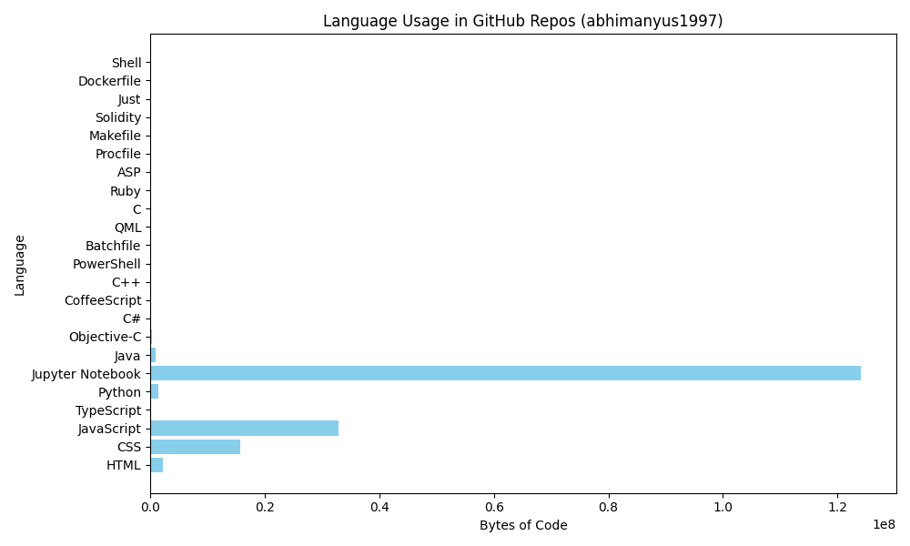

# GitHub Language Report for `abhimanyus1997`
Generated on `2025-06-07 20:00:14`

## Total Language Usage:
- **Jupyter Notebook**: 124075811 bytes
- **JavaScript**: 32832161 bytes
- **CSS**: 15636325 bytes
- **HTML**: 2158107 bytes
- **Python**: 1481088 bytes
- **Java**: 931694 bytes
- **Objective-C**: 283737 bytes
- **C**: 191445 bytes
- **TypeScript**: 151118 bytes
- **C++**: 117561 bytes
- **C#**: 65684 bytes
- **Batchfile**: 39103 bytes
- **CoffeeScript**: 30060 bytes
- **Solidity**: 26381 bytes
- **PowerShell**: 10803 bytes
- **Just**: 4042 bytes
- **QML**: 2765 bytes
- **Shell**: 820 bytes
- **Ruby**: 724 bytes
- **Dockerfile**: 301 bytes
- **Makefile**: 300 bytes
- **ASP**: 214 bytes
- **Procfile**: 95 bytes

## Per-Repository Breakdown:

### abhimanyus1997

### abhimanyus1997.github.io
- HTML: 38471 bytes
- CSS: 3734 bytes
- JavaScript: 2922 bytes

### abhimanyus1997.github.io-old
- TypeScript: 52436 bytes
- CSS: 1594 bytes
- JavaScript: 571 bytes

### Alpha_VoiceKit
- HTML: 9821 bytes

### Basic-Python-Programs
- Python: 170916 bytes

### blenderGoogleGPU
- Jupyter Notebook: 5363 bytes
- Python: 2666 bytes

### cordova-samples
- JavaScript: 5462885 bytes
- HTML: 452795 bytes
- CSS: 417156 bytes
- Java: 223637 bytes
- Objective-C: 177718 bytes
- TypeScript: 43977 bytes
- C#: 43575 bytes
- CoffeeScript: 30060 bytes
- C++: 22001 bytes
- PowerShell: 10803 bytes
- Batchfile: 7151 bytes
- QML: 2765 bytes
- C: 1974 bytes
- Ruby: 724 bytes
- ASP: 214 bytes

### cryptoTracker
- Jupyter Notebook: 2412401 bytes
- HTML: 433492 bytes
- CSS: 177838 bytes
- Python: 27522 bytes
- JavaScript: 24265 bytes
- Batchfile: 559 bytes
- Procfile: 72 bytes

### DigiFit
- HTML: 692052 bytes
- JavaScript: 636228 bytes
- Java: 328965 bytes
- CSS: 68817 bytes
- Batchfile: 13474 bytes
- Objective-C: 12543 bytes
- C#: 6133 bytes
- C++: 3074 bytes

### document-qa
- Python: 1850 bytes

### economic-analysis
- Jupyter Notebook: 1619024 bytes

### flask-test
- Python: 256 bytes
- Procfile: 23 bytes

### GarbageRobo
- C++: 92486 bytes

### GemmaCVMatcher
- Python: 25605 bytes

### generativeTiles
- HTML: 2520 bytes
- JavaScript: 1411 bytes
- CSS: 257 bytes

### IBM-Data-Science
- Jupyter Notebook: 10350456 bytes

### ineuron-fsds
- Jupyter Notebook: 279384 bytes

### Innovacer-Frontend
- CSS: 511998 bytes
- JavaScript: 169465 bytes
- HTML: 7434 bytes

### Jatin-Bhandari

### langchain-one
- Jupyter Notebook: 6938825 bytes
- Python: 30129 bytes

### MedicalAIProjects
- Jupyter Notebook: 7891 bytes

### ML-Basics
- Jupyter Notebook: 8236383 bytes

### myPortfolio
- HTML: 81249 bytes

### pdf2ppt
- Python: 2935 bytes

### pirApp
- TypeScript: 15450 bytes
- HTML: 3087 bytes
- CSS: 2967 bytes
- JavaScript: 1734 bytes

### pirbot
- JavaScript: 26423083 bytes
- CSS: 14450718 bytes
- HTML: 383419 bytes
- Java: 379092 bytes
- Objective-C: 93476 bytes
- C: 75928 bytes
- Batchfile: 17518 bytes
- C#: 15976 bytes
- Python: 11066 bytes

### pirControl
- C: 113543 bytes
- JavaScript: 54227 bytes
- HTML: 29773 bytes
- Python: 3727 bytes
- Makefile: 300 bytes
- CSS: 129 bytes

### polymer-testnet
- JavaScript: 53241 bytes
- Solidity: 26381 bytes
- Just: 4042 bytes

### python-cvcourse
- Jupyter Notebook: 63874517 bytes
- Python: 3632 bytes

### pythonTutor
- Jupyter Notebook: 40556 bytes
- Python: 7370 bytes
- Batchfile: 401 bytes

### qr-automation-tool
- Python: 4921 bytes

### Renal-Disease-Classification
- Python: 10709 bytes
- Jupyter Notebook: 5978 bytes

### Resume-Matcher
- Python: 100951 bytes
- Jupyter Notebook: 39915 bytes
- TypeScript: 39255 bytes
- JavaScript: 868 bytes
- CSS: 584 bytes
- Dockerfile: 301 bytes

### Review-scrapper-and-analyzing-tool-for-flipkart
- Jupyter Notebook: 2537366 bytes

### sketchMaker
- HTML: 11426 bytes
- JavaScript: 1261 bytes
- CSS: 372 bytes

### sorweb
- HTML: 12568 bytes
- CSS: 161 bytes

### TensorFlow
- Jupyter Notebook: 449484 bytes
- Python: 848 bytes

### text-tools
- Jupyter Notebook: 94947 bytes
- Python: 5495 bytes

### yolov9
- Python: 1070490 bytes
- Jupyter Notebook: 4476 bytes
- Shell: 820 bytes

### zero-to-mastery-ml
- Jupyter Notebook: 27178845 bytes
